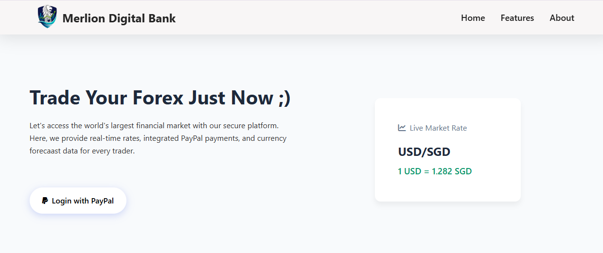
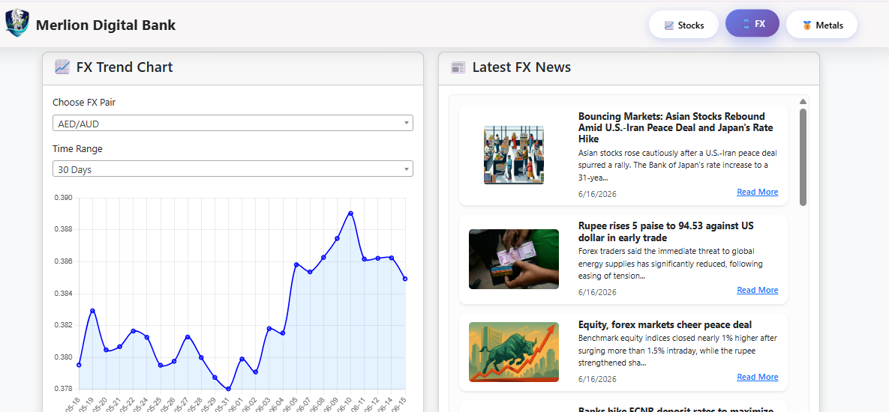
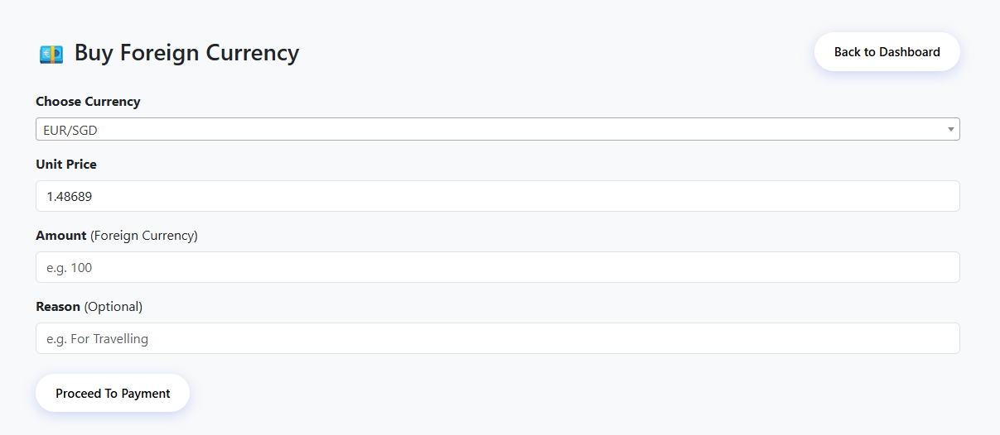
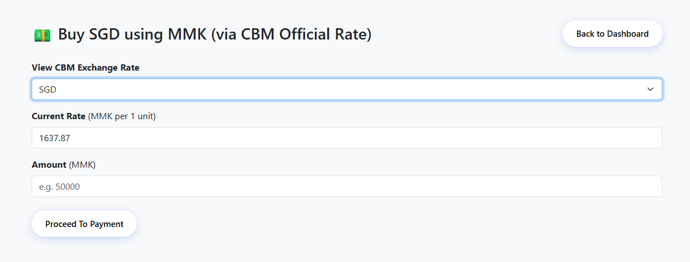
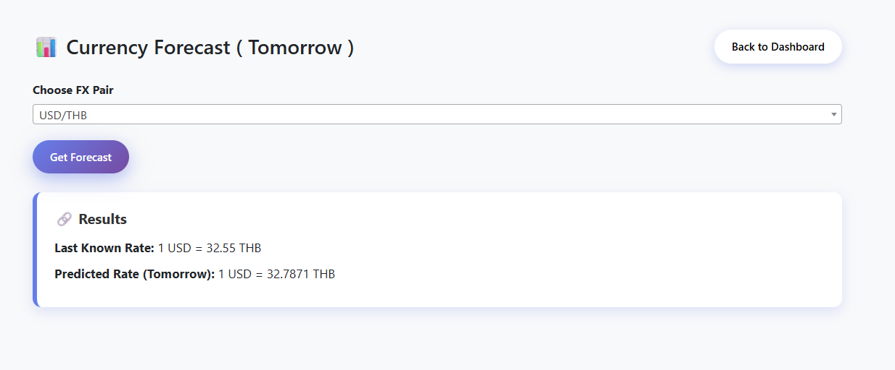

# MerlionFX

MerlionFX is a Flask-based foreign exchange analytics platform that provides real-time currency information, market trends, exchange rate conversion, financial news aggregation, predictive forecasting, and payment simulation capabilities.

The platform integrates multiple financial data sources to help users monitor foreign exchange markets, analyze currency trends, convert currencies, and explore future exchange rate predictions through machine learning techniques.

## Features

### Real-Time FX Market Data

- View live foreign exchange rates
- Select and compare currency pairs
- Monitor market movements
- Analyze historical exchange rate trends

### Interactive FX Charts

- Dynamic exchange rate visualization
- Multiple time range selection
- Historical trend analysis
- Interactive Chart.js dashboard

### Financial News Feed

- Latest foreign exchange news
- Market-related updates
- News aggregation from external sources
- Direct links to full articles

### Currency Conversion

- Real-time exchange rate conversion
- MMK conversion support
- Central Bank of Myanmar exchange rates
- Multi-currency calculations

### Payment Simulation

- PayPal Sandbox integration
- Simulated FX purchase workflow
- Payment result verification
- Transaction testing environment

### Currency Forecasting

- Historical data analysis
- Linear Regression prediction model
- Future exchange rate estimation
- Basic machine learning implementation

## Tech Stack

### Backend

* Python
* Flask

### Frontend

* HTML5
* CSS3
* JavaScript
* Bootstrap
* jQuery
* Select2

### Data Visualization

* Chart.js

### APIs & Services

* PayPal Sandbox API
* Polygon.io API
* GNews API
* Central Bank of Myanmar API

### Machine Learning

* NumPy
* Scikit-Learn
* Linear Regression


## Screenshots

### Home


### Dashboard


### Buy FX Currency


### Currency Converter


### Currency Forecast



## Demo


## PayPal Sandbox Setup

This project uses **PayPal Sandbox** for payment testing.  
Sandbox payments do not use real money.

To test the payment feature, you need a PayPal Developer account.

### Steps

1. Go to the PayPal Developer Dashboard.
2. Log in with your PayPal account.
3. Create or use a Sandbox Business account.
4. Copy the Sandbox API credentials:
   - Client ID
   - Secret
5. Add them to your `.env` file:

### Environment Variables

Copy `.env.example` to `.env` and fill in your own values.


## Installation

### Clone Repository

```bash
git clone https://github.com/MayThetNaingBo/MerlionFX-app.git
cd merlionfx
```

### Create Virtual Environment

```bash
python -m venv venv
```

Activate:

Windows:

```bash
venv\Scripts\activate
```

### Install Dependencies

```bash
pip install -r requirements.txt
```


### Run Application

```bash
python app.py
```

Application:

```text
http://localhost:5000
```


### Dashboard

Provides:

* FX market overview
* Currency pair selection
* Market information

### Trend Analysis

Provides:

* Historical exchange rates
* Interactive charts
* Multi-range trend visualization

### FX News

Provides:

* Latest forex news
* Market updates
* External article links

### MMK Converter

Provides:

* MMK conversions
* Central Bank exchange rates
* Currency calculations


## How It Works

1. User accesses dashboard.
2. Application retrieves market data from APIs.
3. User selects a currency pair.
4. Historical rates are displayed using Chart.js.
5. User can convert currencies.
6. User can view latest FX news.
7. Forecast engine analyzes historical rates.
8. Linear Regression predicts future movement.
9. User may simulate payment using PayPal Sandbox.

## What I have learnt

* Building web applications using Flask
* Working with REST APIs
* Processing financial market data
* Implementing currency conversion systems
* Integrating PayPal Sandbox payments
* Visualizing data using Chart.js
* Using machine learning for forecasting
* Handling real-time financial information
* Structuring full-stack Python applications


## Author

May Thet Naing Bo

Software Developer focused on Full-Stack Development, DevOps, Cloud Technologies, and AI-powered Applications.
